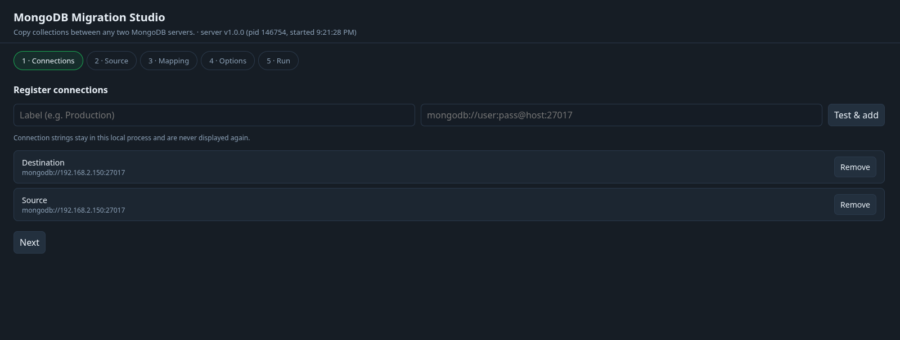
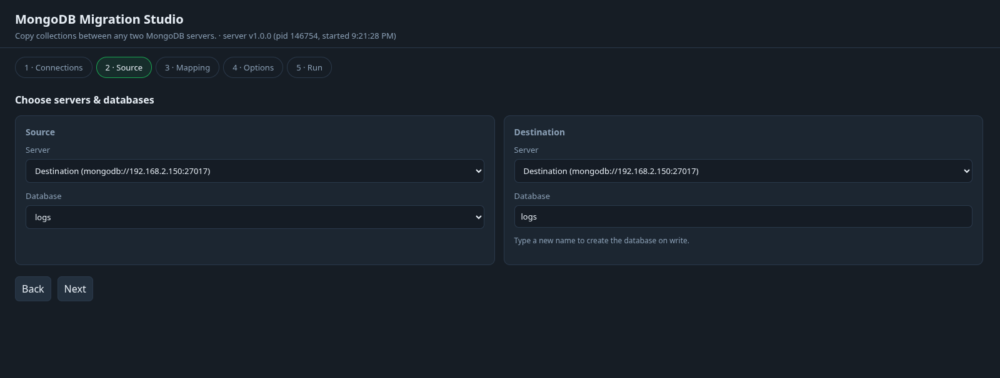
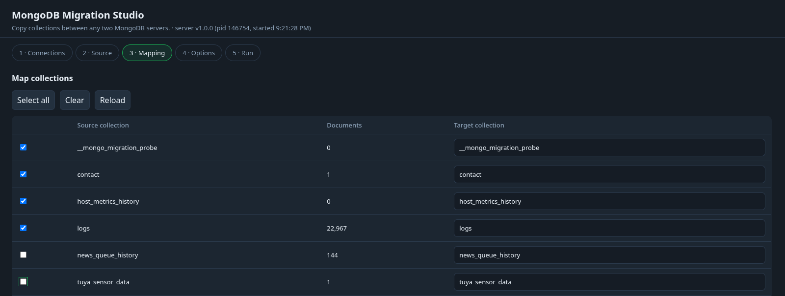
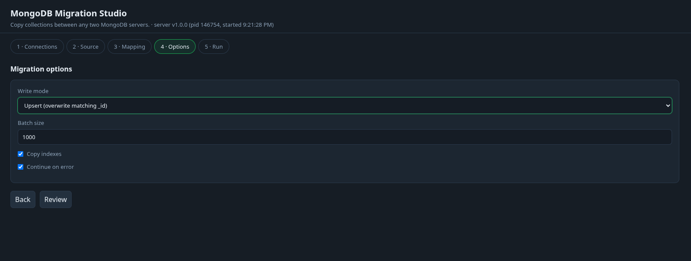
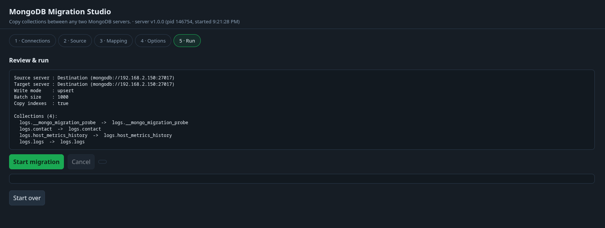

# MongoDB Migration Studio

Copy one or many MongoDB collections from one server to another through a local web wizard.

MongoDB Migration Studio is intended for a trusted operator on a workstation.
It is not an internet-facing service.

## Screenshots

The local web wizard guides you through the migration setup:

### 1. Register connections



### 2. Choose source and destination



### 3. Map collections



### 4. Configure migration options



### 5. Review and run



## Requirements

- Node.js 20 or newer for running from source
- Network access from the workstation to both MongoDB servers
- MongoDB credentials with permission to read the source and write the destination

## Run from source

```bash
npm install
npm start           # opens http://127.0.0.1:4321
```

Environment variables: `PORT` (default `4321`), `HOST` (default `127.0.0.1`), `NO_OPEN=1` to skip auto-opening the browser.

To configure a different local port or host, export the variables before starting:

```bash
HOST=127.0.0.1 PORT=5000 NO_OPEN=1 npm start
```

Copy `.env.example` as a reference only. The application does not load `.env` files,
and MongoDB connection strings should never be stored in environment files or committed.

## Wizard steps

1. **Connections** – add each server by connection string; it is tested with a ping before being accepted. URIs stay in the local process memory and are never sent back to the browser or written to disk.
2. **Source** – pick source server + database, and destination server + database (type a new name to create it).
3. **Mapping** – all collections of the source database are detected automatically; tick the ones to copy and optionally rename the target collection.
4. **Options** – write mode, batch size, index copying, error handling.
5. **Run** – live per-collection progress, log stream, and cancel.

### Write modes

| Mode | Behaviour |
| --- | --- |
| `insert` | Inserts documents, skips existing `_id` duplicates |
| `upsert` | Replaces documents with a matching `_id` |
| `drop` | Drops the target collection first, then inserts |

## Standalone executables

You can build self-contained executables for multiple operating systems. End
users do not need to install Node.js, npm, or the project dependencies to run a
standalone executable.

```bash
npm run build          # all targets -> dist/
npm run build:linux
npm run build:win
npm run build:macos
```

Produces self-contained binaries (Linux x64, Windows x64, macOS x64 + arm64) that require no installed Node.js.

| Platform | Build output |
| --- | --- |
| Linux x64 | `mongo-migration-linux-x64` |
| Windows x64 | `mongo-migration-win-x64.exe` |
| macOS Intel | `mongo-migration-macos-x64` |
| macOS Apple Silicon | `mongo-migration-macos-arm64` |

The build itself requires Node.js 20 or newer. Build the executable on a
machine with Node.js, then distribute the matching file from `dist/` to users.

## Security and privacy

- The web server binds to `127.0.0.1` by default and rejects non-local API hosts.
- MongoDB URIs and credentials stay in process memory and are not returned to the browser or written to disk.
- Do not expose the server to a public network. If `HOST` is changed, protect access with an appropriate local firewall and network controls.
- Review the selected collections, destination database, and write mode before starting a migration. The `drop` mode removes matching target collections first.

## Troubleshooting

### The browser does not open

Start with `NO_OPEN=1` and visit the printed local URL manually. Browser auto-opening is best effort.

### A connection fails

Check the URI, credentials, TLS settings, firewall rules, and whether the MongoDB user can run `ping` and list the required databases. The tool connects to both servers from the machine running the app.

### A standalone build fails

Run the build command on a supported target or use the matching platform-specific command. For source use, install Node.js 20 or newer and run `npm install`.

## Development

```bash
npm install
npm test
npm run dev
```

See [CONTRIBUTING.md](CONTRIBUTING.md) for pull request expectations. Please report reproducible bugs through GitHub Issues and remove all connection strings and other secrets from reports.
